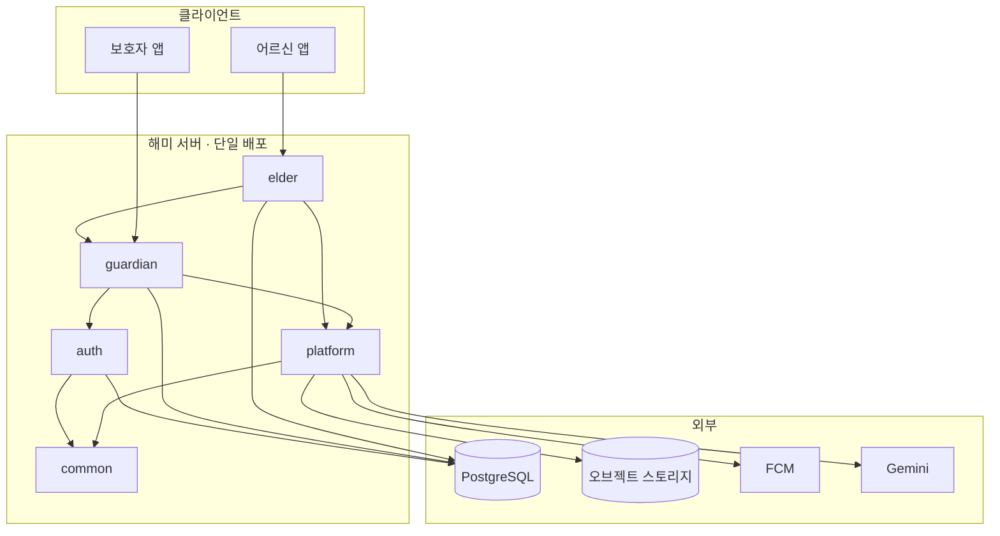
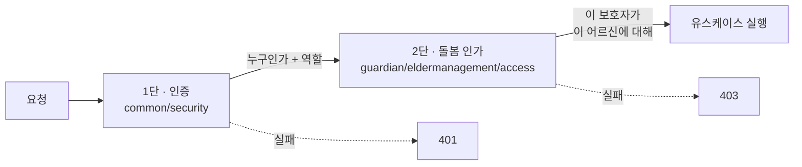
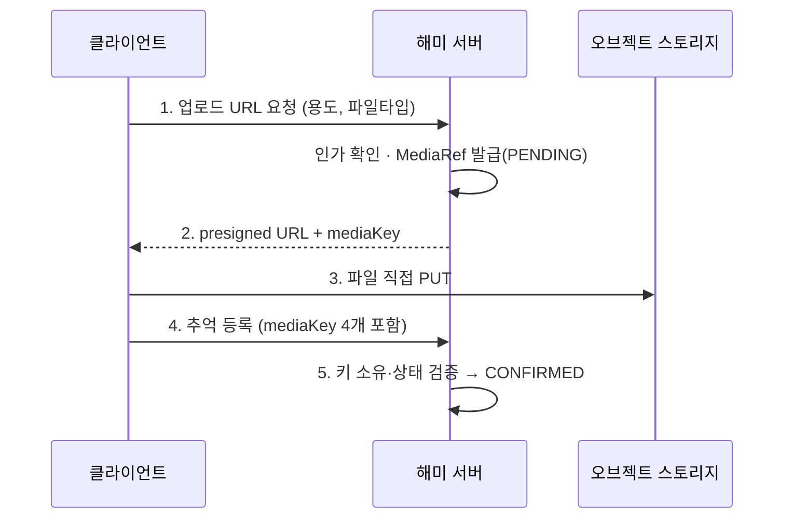
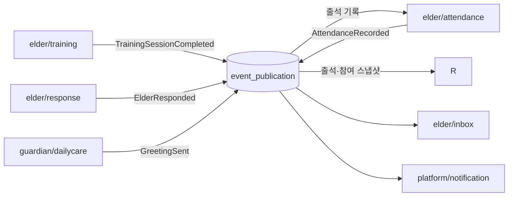
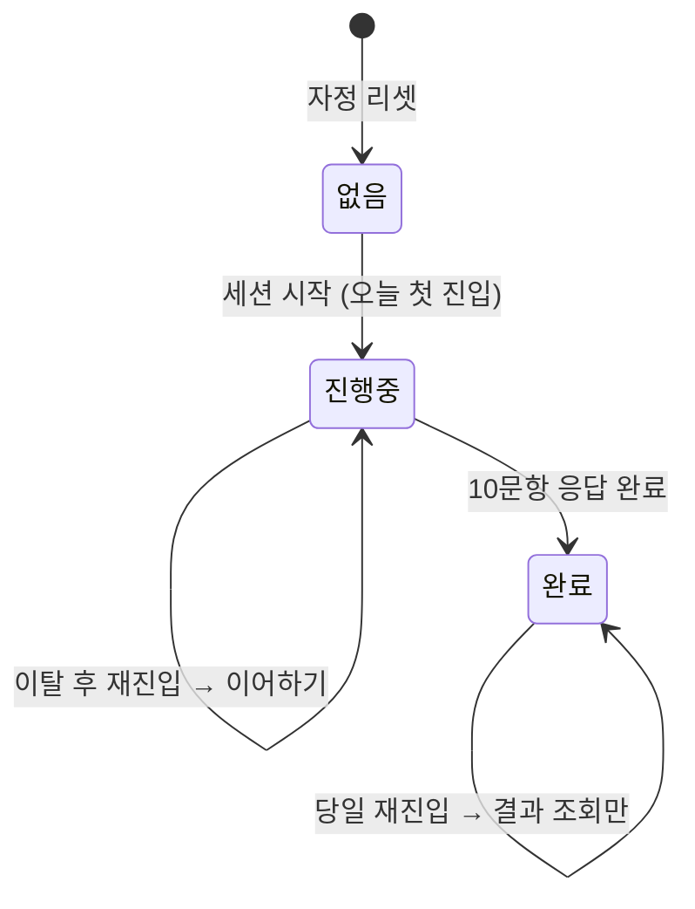

# 해미 v2 — 아키텍처 설계

> 기준: [v2-functional-spec.md](./v2-functional-spec.md) · [v2-module-architecture.md](./v2-module-architecture.md)
> 확정일: 2026-08-22

패키지 구조와 의존 규칙은 [모듈 구조 문서](./v2-module-architecture.md)에 있습니다. 이 문서는 **그 위에서 내린 기술 결정과 근거**를 다룹니다. 각 항목은 "무엇을 정했는가 / 왜 / 안 그러면 무엇이 깨지는가" 순입니다.

---

## 0. 이 서비스의 아키텍처적 특징

일반적인 CRUD 서비스와 다른 지점이 넷 있고, 결정 대부분이 여기서 나왔습니다.

| 특징 | 근거 | 결과 |
| --- | --- | --- |
| **클라이언트가 둘** | 보호자 앱 / 어르신 앱. 같은 데이터라도 보여줄 것이 다름 | 그룹을 `guardian` / `elder`로 분리 (§6) |
| **접근 주체가 다대다** | 보호자 N명 × 어르신 4명, 어르신마다 관계 라벨 | 인가를 도메인 관심사로 승격 (§2) |
| **하루 경계가 도메인 규칙** | 자정 리셋, 스트릭, 쿨다운 7일, 재투입 14~30일 | 시간을 주입 가능한 일급 의존으로 (§3) |
| **미디어가 본문** | 추억 이미지 4장, 음성 1분, 댓글 이미지 | 미디어 파이프라인 분리 (§5) |

---

## 1. 전체 스타일 — 모듈러 모놀리스

**결정**: 단일 배포 단위 + 모듈 경계 강제. MSA 아님.

**근거**: 2인 팀에 배포 파이프라인 하나. 트랜잭션 일관성이 필요한 지점(어르신 계정 생성 = `guardian/eldermanagement` + `auth/account`)이 있어 분산 트랜잭션을 피하는 게 낫습니다. 경계는 런타임이 아니라 **컴파일·테스트로** 강제합니다.



---

## 2. 인가 아키텍처 ★

v2를 새로 짓는 근본 이유입니다. **인증과 인가를 다른 계층에서 처리합니다.**

### 2단 구조



**1단 — 인증 (`common/security` + `auth/session`)**: JWT로 "누구인가"와 `ROLE_GUARDIAN` / `ROLE_ELDER`만 판정합니다. URL 패턴 단위 접근 제어까지가 여기 역할입니다.

**2단 — 돌봄 인가 (`guardian/eldermanagement/access`)**: "이 보호자가 **이 어르신**에 대해 권한이 있는가". Spring Security로는 표현할 수 없는 관계 기반 판단이고, v1이 `elders.group_id UNIQUE`로 우회했던 지점입니다.

```java
// guardian/api/CareAccessQuery.java
public interface CareAccessQuery {
    void requireGuardianOf(UserId guardianId, ElderId elderId);  // 위반 시 예외
    boolean canAccess(UserId guardianId, ElderId elderId);
    List<ElderId> accessibleElders(UserId guardianId);
}
```

### 강제 방법

`elderId`가 등장하는 모든 유스케이스는 **첫 줄에서 정책을 호출합니다.**

```java
@Transactional
public MemoryId register(UserId actor, RegisterMemoryCommand cmd) {
    careAccess.requireGuardianOf(actor, cmd.targetElderId());   // 반드시 첫 줄
    ...
}
```

**빠뜨리는 걸 어떻게 막는가** — 관례로는 못 막습니다. 두 겹으로 방어합니다.

1. **ArchUnit**: `application`의 public 메서드 중 `ElderId`를 받는 것은 `CareAccessQuery` 호출을 반드시 포함해야 한다.
2. **인가 테스트 필수**: 유스케이스마다 "권한 없는 보호자 → 403" 1건.

### 어르신 쪽

어르신은 **자기 것만** 봅니다. 관계 조회가 필요 없으므로 `requireSelf(actor, elderId)`로 끝냅니다. 어르신 토큰으로 다른 어르신 리소스에 접근하는 경로는 아예 만들지 않습니다.

세부 인가 정책은 [인가 규칙](./v2-authorization.md)이 유일한 근거입니다. 가족당 보호자는 8명, 나중에 합류한 보호자는 이전 추억·답변·리포트도 조회할 수 있으며, 어르신의 보호자 차단·해제는 MVP 제외입니다.

---

## 3. 시간 아키텍처

**결정**: `common/time/HaemiClock`을 주입하고, 서비스 기준시는 **KST 고정**입니다.

```java
public interface HaemiClock {
    ZoneId KST = ZoneId.of("Asia/Seoul");
    Instant now();
    LocalDate today();                      // Asia/Seoul 기준
    static LocalDate dateInKst(Instant instant);
}
```

**근거**: 도메인 규칙 상당수가 날짜 경계 위에 있습니다.

| 규칙 | 출처 | 담당 |
| --- | --- | --- |
| 1일 1세션, 00:00 KST 리셋 | 정량 4.1 | `elder/training` |
| 스트릭 — 자정 미완료 시 리셋 | 정량 4.5 | `elder/attendance` |
| 콘텐츠 쿨다운 7일 / 재투입 14~30일 | 정량 4.4 | `platform/content` |
| 최근 7일·4주 집계 | RPT-ATT-003 | `guardian/report` |
| 하루 한마디 1일 1회 | HOME | `guardian/dailycare` |

`LocalDate.now()`를 직접 부르면 **스트릭과 쿨다운을 테스트할 수 없습니다.** 30일치 시나리오를 돌려야 하는데 실제로 30일을 기다릴 수 없습니다. 편의가 아니라 테스트 가능성의 문제입니다.

**저장 규칙**: 시각은 `TIMESTAMPTZ`(UTC), **도메인 날짜는 `DATE` 컬럼으로 별도 저장**합니다. `elder_training_sessions.session_date DATE` + `UNIQUE(elder_id, session_date)`로 "하루 1회"를 DB가 보장합니다. 시각에서 매번 날짜를 계산하면 경계에서 중복 세션이 생깁니다.

---

## 4. 영속성

**결정**: PostgreSQL 단일 DB, **스키마 하나 + 그룹·모듈 접두사 테이블**.

```
auth_users                    guardian_families            elder_responses
auth_credentials              guardian_elders              elder_inbox_greetings
auth_verifications            guardian_elder_links         elder_training_sessions
auth_sessions                 guardian_memories            elder_training_answers
                              guardian_memory_images       elder_training_questions
platform_media_refs           guardian_greetings           elder_training_difficulties
platform_content_items        guardian_challenges
platform_content_exposures    elder_training_question_options
                              elder_attendance_daily_participations
platform_notifications        guardian_report_participations
```

**모듈 간 FK는 걸지 않습니다.** `guardian_memories.elder_id`는 `guardian_elders.id`를 논리적으로 참조하지만, `elder_responses.memory_id`처럼 **그룹을 넘는 참조에는 FK를 두지 않습니다.** 참조 무결성은 `CareAccessQuery`를 지나는 시점에 검증됩니다. FK를 걸면 모듈 분리·삭제 정책 변경이 전부 스키마 변경이 됩니다.

**모듈 내부 FK는 겁니다.** `guardian_memory_images.memory_id → guardian_memories.id`는 같은 애그리거트이므로 DB가 지켜야 합니다.

| 항목 | 결정 | 근거 |
| --- | --- | --- |
| PK | `UUID v7` (`common/persistence/UuidGenerator`) | 시간순 정렬 가능해 인덱스 분산 완화 |
| 동시성 | 인지 훈련 응답은 `PESSIMISTIC_WRITE` | 같은 문항의 재전송이 다음 문항을 건너뛰지 않게 세션 행을 잠금 |
| 삭제 | **소프트 삭제 기본** (`deleted_at`) | 추억·훈련 기록은 복구 요구 가능성 높음 |
| 마이그레이션 | Flyway, `V100`부터 순차 적용 | v1의 34개를 승계하지 않음. 중복 생성 위험이 있는 `V1__baseline.sql`은 미사용 |
| 감사 | `created_at` · `updated_at` · `created_by` (`common/persistence/BaseEntity`) | 보호자 여러 명이 같은 가족을 수정 |

**인덱스는 규칙에서 역산합니다.** 콘텐츠 쿨다운이 "최근 7일 제외 + 가장 오래된 것 우선"이므로 `platform_content_exposures(elder_id, exposed_at)`가 필요하고, 이건 해당 모듈의 첫 마이그레이션에 넣습니다.

---

## 5. 미디어 파이프라인 (`platform/media`)

**결정**: 파일 바이트는 API 서버를 통과하지 않습니다. **presigned URL 직업로드**.



**근거**: 음성 1분 + 이미지 4장이 본문에 실리면 요청이 수 MB가 됩니다. 어르신 앱은 불안정한 네트워크를 가정해야 하고, 업로드 실패가 **추억 등록 전체를 실패시키는** 구조는 피해야 합니다.

도메인은 `MediaRef`(키 + 타입 + 크기)만 보관합니다. 스토리지 종류는 `platform/media/infrastructure`가 감춥니다.

**정책 미확정** — 이미지 용량·포맷 상한, 음성 코덱, 보관 기간(추억 "최대 1년" 경과 후 삭제인지 숨김인지)이 명세에 없습니다. 스토리지 비용에 직결되므로 `platform/media`의 첫 마이그레이션 전에 정해야 합니다.

---

## 6. API 규약

**결정**: 그룹별로 경로와 DTO를 분리합니다.

```
/api/v1/auth/**         공통 인증        → auth/presentation
/api/v1/guardian/**     보호자 앱        → guardian/presentation
/api/v1/elder/**        어르신 앱        → elder/presentation
```

**근거**: 같은 추억 데이터라도 응답이 다릅니다.

| | 보호자 (ALB) | 어르신 (E-ALB) |
| --- | --- | --- |
| 표시 | 추억명, 이미지, **어르신 답변 여부** | 추억명, 이미지, **생성자(관계·이름)**, 본인 답변 여부 |
| 정답률·점수 | 해석된 3색 라벨 | **절대 미노출** |

**`elder/presentation/dto`에 점수·정답률·비교 지표가 절대 들어가면 안 됩니다.** 명세가 반복 강조하는 원칙("오답 페널티 없음", "진단명·등수 절대 미노출")이고, DTO를 공유하면 반드시 샙니다. 그룹을 나누면 **구조적으로** 막히고, ArchUnit 규칙으로 한 번 더 막습니다.

### 공통 응답 (`common/web`)

```jsonc
// 성공
{ "data": { ... } }

// 실패
{ "error": { "code": "CARE_ACCESS_DENIED", "message": "...", "field": null } }
```

에러 코드는 `common/error/ErrorCode` enum으로 관리하고 HTTP 상태와 1:1 매핑합니다. 어르신 앱에 내려가는 메시지는 **명세의 정서 톤**을 따릅니다 — "실패했습니다" 대신 "다시 한 번 해볼까요?".

### CIST 세션 API (구현 상태)

| 요청 | 경로 | 핵심 계약 |
| --- | --- | --- |
| POST | `/api/v1/elder/training/session/enter` | 새 세션을 시작하거나 진행 중 세션을 같은 문항으로 이어 간다. 당일 완료 세션은 결과만 포함해 반환한다. |
| POST | `/api/v1/elder/training/session/current-question/complete` | `sessionId`·`questionId`·`questionNumber`을 모두 현재 상태와 대조한 뒤 답변을 한 번만 반영한다. 선택형은 `selectedOption`, 참여형은 `textAnswer` 또는 `voiceMediaRefId`를 보낸다. |
| GET | `/api/v1/elder/training/session/result` | 당일 완료한 세션의 참여 시간·지연 회상 성공 수·해금 배지를 반환한다. |

`questionType`은 클라이언트 입력으로 받지 않는다. 문항 ID와 번호가 현재 세션 진행 상태에 함께 일치해야 하므로, 유실된 응답을 재전송해도 다른 문항을 완료할 수 없다. `inactivityReminderSeconds`는 앱이 90초 무입력 음성 안내를 예약할 수 있게 하는 설정값이며, 어르신 응답에는 정답·점수·정답률을 포함하지 않는다.

---

## 7. 이벤트와 트랜잭션 (`common/event`)

**결정**: 그룹 간 비동기는 **Spring Modulith 이벤트 + JPA 이벤트 발행 레지스트리**(트랜잭셔널 아웃박스).



**근거**: 리포트는 보호자가 어르신 상태를 판단하는 근거입니다. **이벤트가 유실되면 리포트가 조용히 틀립니다** — 에러도 안 나고 며칠 뒤에야 발견됩니다. 아웃박스로 최소 1회 전달을 보장하고, 소비자는 멱등하게 만듭니다(`UNIQUE(elder_id, session_date)`가 자연 멱등키).

`spring-modulith-events-jpa`가 레지스트리를 기본 제공하므로 별도 구현이 필요 없습니다.

**출석은 `elder/attendance`가 유일한 원천입니다.** `TrainingSessionCompleted`의 완료 사실을 출석 모듈이 소비해 `DailyParticipation`을 `(elder_id, participation_date)`로 원자적 멱등 기록하고 `AttendanceRecorded`를 발행합니다. `AttendanceQuery`는 오늘 완료 여부·현재 스트릭·D+·7/30/100일 배지를 이 원천에서 계산합니다. `guardian/report`는 `AttendanceRecorded`만 소비해 출석 스냅샷을 적재합니다.

**트랜잭션 경계는 `application`**. `domain`과 `presentation`에는 `@Transactional`을 쓰지 않습니다.

**동기로 남길 것**: 어르신 계정 생성(`guardian/eldermanagement` → `auth/api/AccountCommand`)은 한 트랜잭션이어야 합니다. User만 생기고 관계가 안 생기면 **로그인은 되는데 아무 데도 속하지 않은 어르신**이 남습니다.

---

## 8. 핵심 흐름 둘

### CIST 세션 — 상태 머신 (`elder/training`)



- `UNIQUE(elder_id, session_date)`로 하루 1회를 DB가 보장
- 진행 지점 = 마지막 응답 문항 인덱스. **이탈은 정상 경로이지 예외가 아님**
- 완료는 되돌릴 수 없음(잠금). 완료 시 `TrainingSessionCompleted` 발행

### 리포트 — 스냅샷 + 조회 시 판정 (`guardian/report`)

**결정**: 원천은 이벤트로 적재하고, **3색 라벨은 조회 시 계산**합니다. 배치로 미리 굽지 않습니다.

**근거**: 데이터가 작습니다(어르신 1명당 하루 1행 = 1년에 365행). 반면 판정 규칙(70%/40%, 4주 연속 하락, 주 5일)은 **바뀔 가능성이 큽니다.** 미리 구워두면 규칙이 바뀔 때마다 재계산 배치가 필요합니다.

```
elder/training ──TrainingSessionCompleted──▶ elder/attendance
                                                    │
                                            AttendanceRecorded
                                                    ▼
                              guardian_report_participations (출석 원천 스냅샷)

        RPT-ATT-003 출석·참여 현황

RPT-ATT-004 영역별 인지 상태와 RPT-ATT-005·006은 별도 인지 스냅샷 계약이 필요해 아직 구현하지 않는다.
```

- `guardian_report_participations`는 `(elder_id, participation_date)`를 유일 키로 하여 `AttendanceRecorded`를 멱등 적재합니다. 최근 7일의 ●/○와 최근 4주 막대는 이 날짜 행으로 만들고, 오늘 행이 없으면 ○입니다.
- 스트릭과 최고 기록은 이벤트에 담긴 가변 숫자를 복사하지 않고, 출석 날짜 스냅샷과 `HaemiClock`으로 **조회 시** 계산합니다. 따라서 자정을 넘겨 미완료가 되면 별도 배치 없이 현재 스트릭이 0으로 보입니다.
- `guardian/report`는 두 모듈의 테이블을 직접 조회하지 않습니다. 현재는 `AttendanceRecorded`만 출석·참여 스냅샷에 사용하며, `TrainingSessionCompleted`는 출석 모듈만 소비합니다.

`guardian/report`는 **`elder/training`의 테이블을 직접 조회하지 않습니다.**

---

## 9. 횡단 관심사

| 관심사 | 결정 |
| --- | --- |
| 예외 | `common/error/DomainException` 계층 → `GlobalExceptionHandler` 단일 지점 변환. **모듈별 예외 클래스 금지** (v1은 `M0NotFoundException` 등 모듈마다 중복) |
| 로깅 | 구조적 로깅 + `RequestIdFilter`의 요청 ID. **어르신 음성·추억 본문은 절대 로깅 금지** |
| 설정 | `@ConfigurationProperties` 타입 세이프. 정량 명세 값(쿨다운 7일, 임계 20개, 정답률 70/40)은 **하드코딩하지 않고 설정으로** — 튜닝 대상임이 명백함 |
| 비밀 | 환경변수 주입. 레포에 커밋 금지 |
| API 문서 | springdoc, 그룹별 분리(`auth` / `guardian` / `elder`) |

---

## 10. 테스트 전략

| 층 | 대상 | 비중 |
| --- | --- | --- |
| 도메인 단위 | 난이도 조절, 스트릭, 쿨다운, 3색 판정 — `common/test`의 고정 Clock으로 시간 시나리오 | 가장 두껍게 |
| 모듈 슬라이스 | `@ApplicationModuleTest` — 모듈 하나만 기동 | 중간 |
| **인가 테스트** | 유스케이스마다 "권한 없는 보호자 → 403" **필수** | 필수 |
| 아키텍처 | `ApplicationModules.verify()` + ArchUnit 2종 | CI 게이트 |
| 통합 | Testcontainers PostgreSQL, 핵심 플로우만 | 얇게 |

**시간 시나리오 테스트가 이 서비스의 핵심 테스트입니다.** "7일 연속 참여 후 하루 빠지면 스트릭이 리셋되는가", "2일 연속 80% 넘으면 레벨이 오르는가" — 이걸 못 하면 정량 명세를 구현했는지 확인할 방법이 없습니다.

---

## 11. 기술 스택

| 영역 | 선택 | 비고 |
| --- | --- | --- |
| 언어/런타임 | Java 21 | v1 동일 |
| 프레임워크 | Spring Boot 4.0.x | v1 동일 |
| 모듈 경계 | **Spring Modulith** | v2 신규 |
| DB | PostgreSQL | v1 동일 |
| 마이그레이션 | Flyway (`V100`부터 새로) | 승계 안 함 |
| 인증 | Spring Security + JWT | v1 자산 재사용 |
| 푸시 | FCM | v1 자산 재사용 |
| 스토리지 | 오브젝트 스토리지 + presigned URL | 신규 |
| AI | Gemini (`platform/ai`) | 신규 |
| 배포 | Docker + EC2 | v1 파이프라인 복사 |

**v1에서 걷어내는 것**: TOTP 2FA, OpenPDF, 기관 포털, 오프라인 모드, 프리다운로드, 기기 명령 아웃박스, 이벤트 로그. 새 명세에 근거가 없습니다.

**v1에서 이식할 후보**: `m3` CIST 로직(86 파일) → `elder/training`, `m4` 리포트(61) → `guardian/report`, `notification`(28) → `platform/notification`. 셋 다 `groupId` 참조가 0개라 1:1 전제에 오염되지 않았습니다. **복사가 아니라 참조 구현**으로 두고 새 모델에 맞춰 포팅합니다.

---

## 12. 착수 순서

의존 방향의 역순으로 세웁니다. 각 단계는 별도 PR입니다.

| # | 단계 | 산출물 |
| --- | --- | --- |
| 1 | 뼈대 | 패키지 트리 + Modulith verify + CI 통과 |
| 2 | `common` + `auth` | Clock, 예외, JWT, PIN 로그인, 이메일 인증 |
| 3 | `guardian/family` + `guardian/eldermanagement` + **`access`** | 다대다 관계, 인가 정책, ArchUnit 규칙 |
| 4 | `platform/media` + `guardian/memory` + `elder/memory` + `elder/response` | 추억 등록·조회·답변 |
| 5 | `platform/content` + `elder/training` + `elder/attendance` | CIST 세션·난이도·쿨다운 (+ 시간 시나리오 테스트) |
| 6 | `guardian/report` | 이벤트 소비, 3색 판정, 서포트 가이드 |
| 7 | `guardian/dailycare` + `elder/inbox` + `elder/home` | 하루 한마디·도전과제·홈 조합 |
| 8 | `platform/notification` · `platform/ai` · `elder/companion` | 명세 확정 후 |

**3단계가 가장 중요합니다.** `CareAccessQuery`와 ArchUnit 규칙이 4단계 전에 들어가야, 이후 모듈들이 처음부터 정책을 호출하는 습관으로 작성됩니다. 나중에 붙이면 v1과 같은 상태가 됩니다.

---

## 13. 추가 기능 착수 전 확정 필요

| 항목 | 영향 범위 |
| --- | --- |
| 계정·가족 생애주기 (계정 삭제, 가족 해체, 전화번호 중복, 초대 코드 수명주기) | 삭제·합류 기능 |
| 미디어 정책 (용량·포맷·보관 기간) | 미디어 업로드·보관 |
| PIN 재설정 플로우 | `auth/credential` |
| 탈퇴·연결 해제 시 추억/훈련 기록 처리 | `guardian/memory` · `elder/training` · `guardian/report` |
| **어르신 홈 화면** 정의 | `elder/home` |
| **하루 한마디 수신 화면** (읽음 처리·보관) | `elder/inbox` |

상세는 [기능명세서 부록 B](./v2-functional-spec.md#부록-b-명세-결손-목록) 참조.
